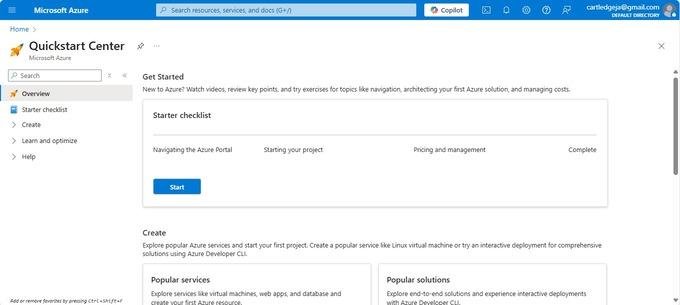
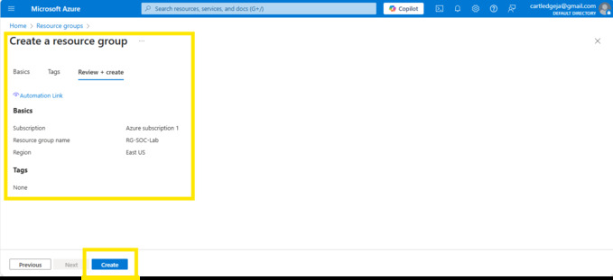
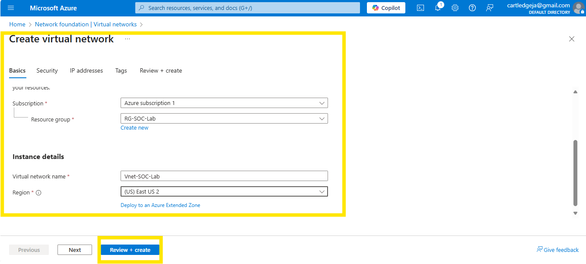
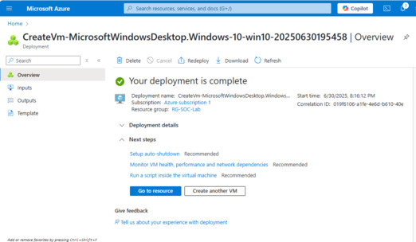
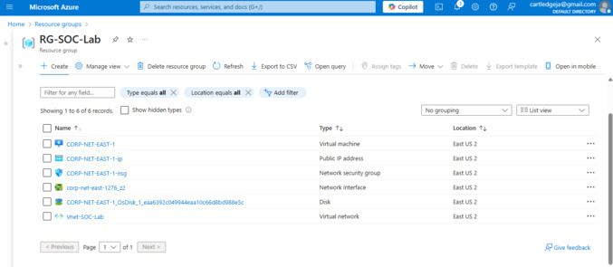
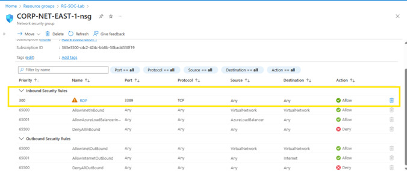
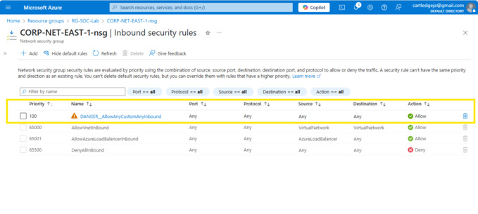

.png)

# Home Security Operation Center (SOC) - Honey Pot Project - Monitoring Live Attacks

<br><ins>Part 1. Setup Azure Subscription and Virtual Machine (VM)</ins>

<br>

<br>
Created an Azure Subscription, and logged in at: [Microsoft Azure](https://portal.azure.com/#home)

<br>

<br>Created Azure Resource Group. A Resource Group is like a container that holds related resources for your cloud solution—think of it as a folder for organizing everything you deploy in Azure.

<br>

<br>Created the Azure Virtual Network (VNET). A VNET is the backbone of networking in Microsoft Azure—it’s your private cloud network where you can securely run and connect resources like virtual machines, databases, and web apps.

<br>

<br>Created the Azure Virtual Machine (VM). A VM is a cloud-based computer you can create and run on Microsoft Azure—without needing to buy or maintain physical hardware.

<br><br>

<br>

<br><ins>Part 2. Create the Honey Pot (Azure Virtual Machine)</ins><br>

In order to create the Honey Pot, the only allow RDP rule in the Network Security Group was deleted, and a rule was created in the Network Security Group for the virtual machine (VM) that allows all traffic inbound.<br>

<br><br>

<br><br>


<br><br>Text can be **bold**, _italic_, or ~~strikethrough~~.

[Link to another page](./another-page.html).

There should be whitespace between paragraphs.

There should be whitespace between paragraphs. We recommend including a README, or a file with information about your project.

# Header 1

This is a normal paragraph following a header. GitHub is a code hosting platform for version control and collaboration. It lets you and others work together on projects from anywhere.

## Header 2

> This is a blockquote following a header.
>
> When something is important enough, you do it even if the odds are not in your favor.

### Header 3

```
```

```
```

#### Header 4

*   This is an unordered list following a header.
*   This is an unordered list following a header.
*   This is an unordered list following a header.

##### Header 5

1.  This is an ordered list following a header.
2.  This is an ordered list following a header.
3.  This is an ordered list following a header.

###### Header 6

| head1        | head two          | three |
|:-------------|:------------------|:------|
| ok           | good swedish fish | nice  |
| out of stock | good and plenty   | nice  |
| ok           | good `oreos`      | hmm   |
| ok           | good `zoute` drop | yumm  |

### There's a horizontal rule below this.

* * *

### Here is an unordered list:

*   Item foo
*   Item bar
*   Item baz
*   Item zip

### And an ordered list:

1.  Item one
1.  Item two
1.  Item three
1.  Item four

### And a nested list:

- level 1 item
  - level 2 item
  - level 2 item
    - level 3 item
    - level 3 item
- level 1 item
  - level 2 item
  - level 2 item
  - level 2 item
- level 1 item
  - level 2 item
  - level 2 item
- level 1 item

### Small image


### Large image


### Definition lists can be used with HTML syntax.

<dl>
<dt>Name</dt>
<dd>Godzilla</dd>
<dt>Born</dt>
<dd>1952</dd>
<dt>Birthplace</dt>
<dd>Japan</dd>
<dt>Color</dt>
<dd>Green</dd>
</dl>

```
Long, single-line code blocks should not wrap. They should horizontally scroll if they are too long. This line should be long enough to demonstrate this.
```

```
The final element.
```
